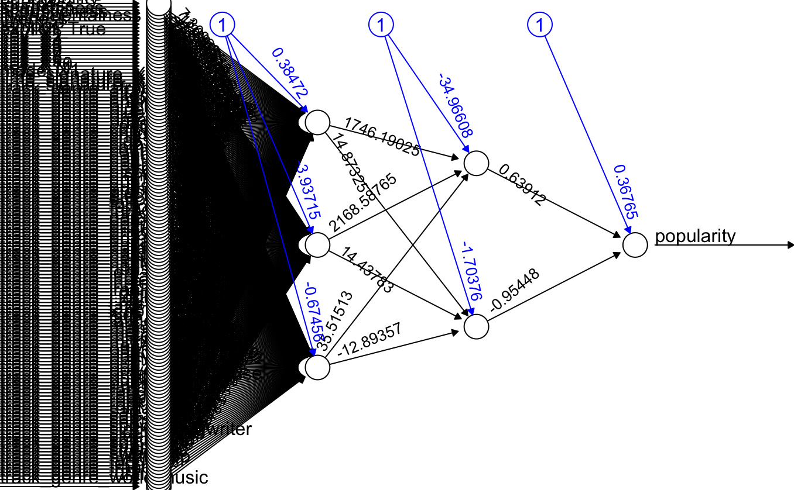

```{r setup, include=FALSE}
knitr::opts_chunk$set(echo = TRUE)
library(tidyverse)
library(caret)
```

## Step 0: Why?

Step 0: Context, Objective, and Financial Model

Project Context: Realistic Spotify Metrics

To ground this analysis in real-world performance, we use approximate public and industry figures for a large streaming platform (Q3 2024 estimates):

```{r, echo=FALSE}
context_data <- data.frame(
  Metric = c("Monthly Active Users (MAU)", 
             "Premium Subscribers", "Average Revenue Per User (ARPU)", 
             "Estimated Monthly Churn Rate", 
             "Customer Lifetime Value (CLV)"),
  Value = c("~600 Million", 
            "~250 Million (42% of MAU)", 
            "~$4.50 / month", 
            "~2.0%", 
            "~$225"),
  Rationale = c("Based on publicly reported figures.", 
                "Based on publicly reported subscription rates.", 
                "Blended rate across different tiers and regions.", 
                "Industry estimate for major streaming services.", 
                "Calculated as ARPU / Churn Rate = $4.50 / 0.02.")
)

colnames(context_data) <- c("Metric", "Estimated Value", "Rationale")
knitr::kable(context_data, caption = "Realistic Spotify Business Metrics", format = "markdown")
```

Objective

Objective: To maximize user retention and daily active listening time, how can Spotify's recommendation engine use a song's audio features (danceability, energy, valence), track_genre, and other variables to build a predictive model that more accurately identifies high-engagement tracks (i.e., high future popularity) for its personalized playlists like 'Discover Weekly'?

Assumption & Financial Model

Assumption: A $10\%$ increase in the number of high-engagement songs a user hears in their 'Discover Weekly' playlist will lead to a very marginal $0.01\%$ decrease in their probability of churning (canceling their subscription) that month.

We translate this into the following Net Financial Impact model to guide the Level 2 Stacker. The model is designed to maximize Net Impact (Revenue - Loss). The $\$$ values reflect the estimated scaled impact on CLV and promotion costs per decision.

```{r, echo=FALSE}
financial_data <- data.frame(
  Outcome = c("True Positive (TP)", "False Positive (FP)", "False Negative (FN)"),
  Metric = c("Correctly identifies a Hidden Gem (Target = 'Yes').", "Predicts 'Yes', but actual is 'No'. (Wasteful promotion)", "Predicts 'No', but actual is 'Yes'. (Lost opportunity)"),
  Financial_Value = c("+$200", "-$500", "-$100"),
  Financial_Rationale = c("Revenue: Estimated net monthly value derived from the 0.01% reduction in churn for a high-value, retained customer. (Maximize)", "Cost: Significant loss from license fees, content storage, and opportunity cost of promoting non-engaging content that accelerates churn. (Minimize - Critical Error)", "Cost: Minor loss from missing a viable track and losing the opportunity for increased engagement and retention. (Minimize - Minor Error)")
)
colnames(financial_data) <- c("Outcome", "Metric", "Financial Value", "Financial Rationale")
knitr::kable(financial_data, caption = "Net Financial Impact Model (Per Prediction)", format = "markdown")
```

The objective is to maximize the Net Impact, calculated as:

$$
\text{Net Impact} = (\text{TP} \times \$200) - (\text{FP} \times \$500) - (\text{FN} \times \$100) 
$$

## Stacked Model Architecture

The process uses a **6-model Level 1 (L1) Ensemble** feeding into a **Level 2 (L2) Stacker**.

| Level | Model Name | Role | Optimization |
|:-----------------|:-----------------|:-----------------|:-----------------|
| **Level 1** | LR, KNN, ANN, RF, DT, SVM | **Specialists:** Trained on raw features (danceability, genre, etc.) to capture diverse linear and non-linear patterns. | Standard statistical metrics (Kappa). |
| **Level 2** | Cost-Sensitive Logistic Regression | **Producer:** Trained on L1 probability outputs using **weighted learning** based on the $5:1$ loss ratio ($-\$500$ FP cost vs. $-\$100$ FN cost). | Maximize Net Financial Impact by aggressively minimizing False Positives. |

## Level 1 Step 1, 2, 3: Importing, Cleaning, Splitting, and Normalizing the Data

```{r, message=FALSE, error=FALSE, warning=FALSE}
source("modules/prep.R")
train = data.frame(X_train, popularity = y_train)
test = data.frame(X_test, popularity = y_test)
```

## Level 1 Step 4, 5, 6: Building, Predicting, and Analyzing the Models

### GLM

Work for this model was done in "modules/logistic.R", however, since the file sizes were so large, the models, probabilities, and predictions were exported into separate files to be used below.

```{r}
glm_prob <- readRDS("probabilities/GLMProbs.RDS")
glm_pred <- readRDS("predictions/GLMPredictions.RDS")
```


```{r}
glm_confusion <- confusionMatrix(as.factor(glm_pred), as.factor(test$popularity), positive = "1")
glm_confusion
```

**What we changed to get the best results**

For the best results, we manipulated the threshold for the predictions to be popular or unpopular. Initially, we used a threshold of 0.5, but after optimizing for accuracy and sensitivity, we used a threshold of -0.6.

### ANN

Work for this model was done in "modules/ann.R", however, since the file sizes were so large, the models, probabilities, and predictions were exported into separate files to be used below.

This is what the model looks like:

```{r}
#library(neuralnet)
ann_model <- readRDS("models/ANNModelM1.RDS")
#plot(ann_model)
```

{width="485"}
Incredible. 

```{r}
ann_prob <- readRDS("probabilities/ANNProbs.RDS")
ann_pred <- readRDS("predictions/ANNPredictions.RDS")
```


```{r}
ann_confusion <- confusionMatrix(as.factor(ann_pred), as.factor(test$popularity), positive = "1")
ann_confusion
```

**What we changed to get the best results** For the best results, we manipulated the threshold for the predictions to be popular or unpopular. Initially, we used a threshold of 0.5, but after optimizing for accuracy and sensitivity, we used a threshold of 0.4.

### SVM

Work for this model was done in "modules/svm.R", however, since the file sizes were so large, the models, probabilities, and predictions were exported into separate files to be used below.

```{r}
svm_prob <- readRDS("probabilities/SVMProbs.RDS")[, 1]
svm_pred <- readRDS("predictions/SVMPredictions.RDS")
```


```{r}
svm_confusion <- confusionMatrix(as.factor(svm_pred), as.factor(test$popularity), positive = "1")
svm_confusion
```

**What we changed to get the best results** For the best results, we manipulated the threshold for the predictions to be popular or unpopular. Initially, we used a threshold of 0.5, but after optimizing for accuracy and sensitivity, we used a threshold of 0.3.

### Random Forest

Work for this model was done in "modules/forest.R", however, since the file sizes were so large, the models, probabilities, and predictions were exported into separate files to be used below.

This is what this model looks like

```{r}
#library(randomForest)
forest_model <- readRDS("models/ForestModelM1.RDS")
#plot(forest_model)
```
And this is how important each variable is

```{r}
randomForest::varImpPlot(forest_model)
```

```{r}
forest_prob <- readRDS("probabilities/ForestProbs.RDS")
forest_pred <- readRDS("predictions/ForestPredictions.RDS")
```


```{r}
forest_confusion <- confusionMatrix(as.factor(forest_pred), as.factor(test$popularity), positive = "1")
forest_confusion
```

**What we changed to get the best results** For the best results, we manipulated the threshold for the predictions to be popular or unpopular. Initially, we used a threshold of 0.3, but after optimizing for accuracy and sensitivity, we used a threshold of 0.35.

### KNN

Work for this model was done in "modules/knn.R", however, since the file sizes were so large, the models, probabilities, and predictions were exported into separate files to be used below.

```{r}
knn_prob <- readRDS("probabilities/KNNProbs.RDS")
knn_pred <- readRDS("predictions/KNNPredictions.RDS")
```


```{r}
knn_confusion <- confusionMatrix(as.factor(knn_pred), as.factor(test$popularity), positive = "1")
knn_confusion
```

**What we changed to get the best results** For the best results, we manipulated the threshold for the predictions to be popular or unpopular. Initially, we used a threshold of 0.5, but after optimizing for accuracy and sensitivity, we used a threshold of 0.3.

### Decision Tree

Work for this model was done in "modules/knn.R", however, since the file sizes were so large, the models, probabilities, and predictions were exported into separate files to be used below.

This is what this model looks like

```{r}
library(C50)
decision_model <- readRDS("models/DecisionModelM1.RDS")
plot(decision_model)
```

Incredible. 

```{r}
decision_prob <- readRDS("probabilities/DecisionProbs.RDS")
decision_pred <- readRDS("predictions/DecisionPredictions.RDS")
```


```{r}
decision_confusion <- confusionMatrix(as.factor(decision_pred), as.factor(test$popularity), positive = "1")
decision_confusion
```
Baseline for level 1:

```{r, warning=FALSE, message=FALSE}
baseline_pred = rep(1, length(decision_pred))
baseline_confusion = confusionMatrix(as.factor(baseline_pred), as.factor(test$popularity), positive = "1")
```


```{r}
SONGS_PER_MONTH = 30
TP_PROFIT = 200
FP_COST =   500
FN_COST =   100

netimpact = function(conf, elias=TRUE) {
  t= conf$table
  tp = t[2,2]
  fp = t[2,1]
  fn = t[1,2]
  if (elias) {
    SONGS_PER_MONTH = 30
    TP_PROFIT = 340268
    FP_COST =   453690
    FN_COST =   340268
    n_months = sum(conf$table) / SONGS_PER_MONTH 
    val = (TP_PROFIT*tp - FP_COST*fp - FN_COST*fn) / n_months
    return(val)
  } else {
    TP_PROFIT = 200
    FP_COST =   500
    FN_COST =   100
    val = (TP_PROFIT*tp - FP_COST*fp - FN_COST*fn)
    return(val)
  }
}

ni_improve = function(conf, bl) {
  ni_model = netimpact(conf)
  ni_base  = netimpact(bl)

  return((abs(ni_base) - abs(ni_model)) / abs(ni_base))
}

sumtable = function(conf_list, leveltwo = FALSE, bl1, bl2) {

  df = lapply(names(conf_list), function(nm) {
    conf = conf_list[[nm]]
    tibble(
      Model       = nm,
      Accuracy    = scales::percent(conf$overall["Accuracy"], accuracy = .01),
      Sensitivity = scales::percent(conf$byClass["Sensitivity"], accuracy = .01),
      Kappa       = signif(conf$overall[["Kappa"]], 2),
      `Net Impact` = scales::dollar(netimpact(conf)),
      improvement  = NA_character_
    )
  }) |> bind_rows()

  n = nrow(df)

  if (!leveltwo) {
    df$improvement =
      scales::percent(sapply(conf_list, ni_improve, bl = bl1), accuracy = .1)
  } else {
    df$improvement[1:(n-1)] =
      scales::percent(
        sapply(conf_list[1:(n-1)], ni_improve, bl = bl1),
        accuracy = .1
      )

    df$improvement[n-1] =
      scales::percent(
        ni_improve(conf_list[[n-1]], bl2),
        accuracy = .1
      )
    df$improvement[n] =
      scales::percent(
        ni_improve(conf_list[[n]], bl2),
        accuracy = .1
      )
  }
  kb = df |> rename(`% Improvement` = improvement) |>
    kableExtra::kbl(caption = "Model Performance Summary") |>
    kableExtra::kable_classic()

  if (leveltwo) {
    kb = kb |>
      kableExtra::group_rows("Level 1", 1, n - 2) |>
      kableExtra::group_rows("Level 2", n-1, n)
  }

  return(kb)
}

```


**What we changed to get the best results** For the best results, we manipulated the threshold for the predictions to be popular or unpopular. Initially, we used a threshold of 0.5, but after optimizing for accuracy and sensitivity, we used a threshold of 0.19.

### All of the Level 1 Models

```{r, echo=FALSE}
conflist = list(
  Baseline = baseline_confusion,
  ANN = ann_confusion,
  KNN = knn_confusion,
  GLM = glm_confusion,
  SVM = svm_confusion,
  Forest = forest_confusion,
  Tree = decision_confusion
)

sumtable(conflist, bl1=baseline_confusion)

```

### Combining the models

```{r}
combined_models <- data.frame(ann_pred, decision_pred, forest_pred, glm_pred, knn_pred, svm_pred, test$popularity)
```

## Part 2: Building a Second Level Decision Tree

Since we combined the models right above, there is no need to import of clean them.

### Step 3: Split the Data

```{r}
trainfrac2 <- 0.7
set.seed(12345)

trainrows <- sample(1:nrow(combined_models), trainfrac2*nrow(combined_models))

train2 <- combined_models[trainrows, ]
test2 <- combined_models[-trainrows, ]
```

### Step 4: Building the Model

```{r}
library(C50)
decision_2 <- C5.0(as.factor(test.popularity) ~., data = train2)
```

### Step 5: Predicting with the Model

```{r}
decision_p2 <- predict(decision_2, test2, type = "prob")
decision_p2 <- decision_p2[, 2]

decision_pred2 <- ifelse(decision_p2 >= .5, 1, 0)
```

### Step 6: Analyzing the Model

```{r}
decision2_confusion <- confusionMatrix(as.factor(decision_pred2), as.factor(test2$test.popularity), positive = "1")
decision2_confusion
```
Baseline for level 2:

```{r, warning=FALSE, message=FALSE}
baseline_pred2 = rep(1, length(decision_pred2))
baseline_confusion2 = confusionMatrix(as.factor(baseline_pred2), as.factor(test2$test.popularity), positive = "1")
```


## Step 7: Conclusion

```{r, echo=FALSE}
conflist = list(
  Baseline = baseline_confusion,
  ANN = ann_confusion,
  KNN = knn_confusion,
  GLM = glm_confusion,
  SVM = svm_confusion,
  Forest = forest_confusion,
  Tree = decision_confusion,
  `2nd Level Baseline` = baseline_confusion2,
  `2nd Level Tree` = decision2_confusion
)

sumtable(conflist, leveltwo = T, bl1 = baseline_confusion, bl2 = baseline_confusion2)
```

### Overall Conclusion

### Possible Errors
